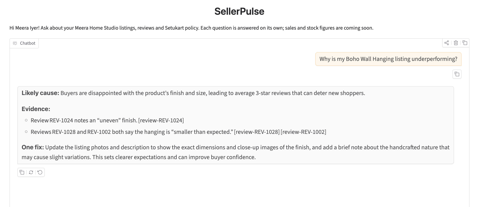
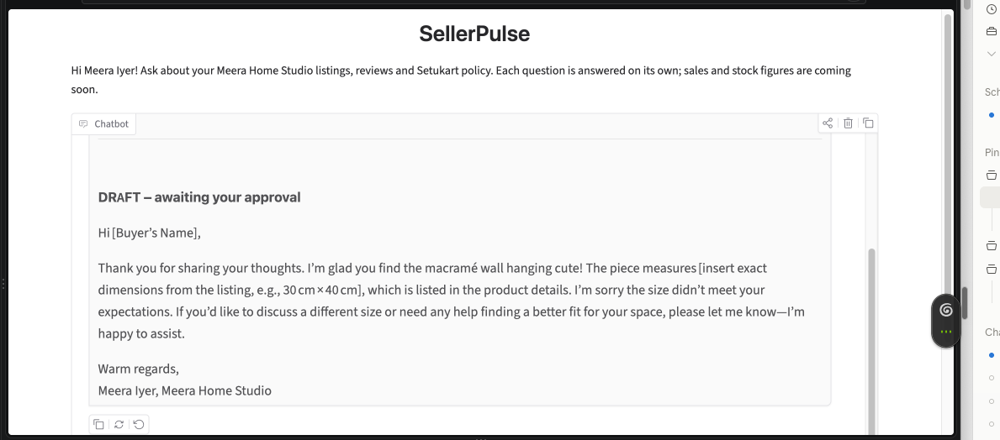

# Task 11: Gradio chat UI

## Screenshots

Diagnosis (DoD query):

Draft review reply:

## Runs

- Run: `uv run python agent.py` (local) / `uv run python agent.py --share` (public link)
- Diagnosis: "Why is my Boho Wall Hanging listing underperforming?" → grounded diagnosis citing REV-1024, REV-1028, REV-1002. PASS (DoD).
- Draft reply: PASS on format (DRAFT label, addressed to the buyer, signed "Meera Iyer, Meera Home Studio", no mention of SellerPulse). Findings: claims dimensions are "listed in the product details" (false: the Boho listing has no dimensions, which is the real cause of "smaller than expected"); invents example size "30 cm × 40 cm"; adds a soft offer Meera did not ask for. → Week 3 guardrails.
- Sales: PASS. No figures invented; says it has no sales data (same as Task 10 run 2).
- Policy (free gift for 5-star review): FILL IN — did it decline, explain why, and offer a compliant alternative?

## Share link

`--share` failed on the corporate laptop ("Could not create share link"): tunnel blocked by company network/security. Not bypassed. Next: Biswajit runs `--share` from his machine (also tests Task 4: clone + README). Permanent link in Task 34 (deployment).

## Design

gr.ChatInterface; history shown but not sent to the LLM (memory is Week 2); share is opt-in to protect the Groq free quota.
